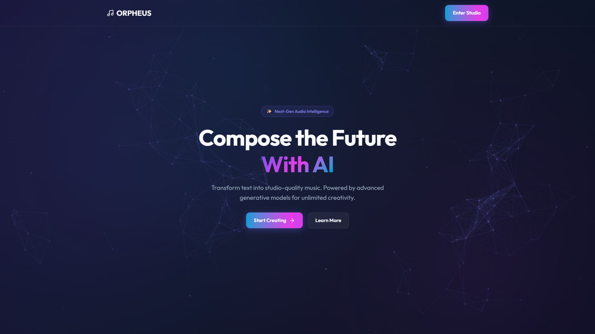
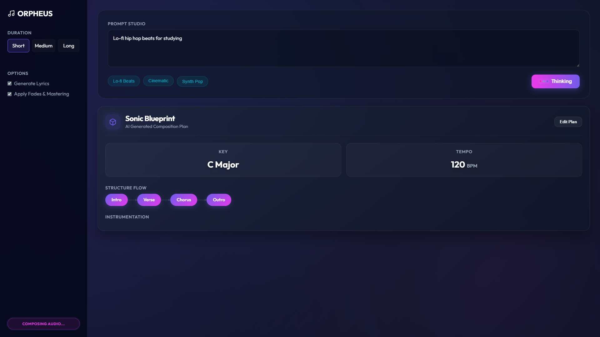
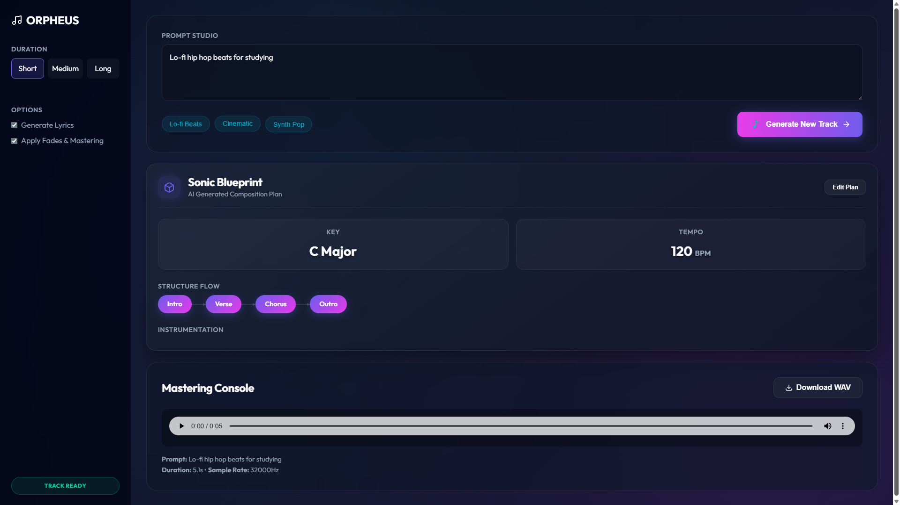

# Project Orpheus 🎵

**AI-Powered Music Generation Studio**

A premium web application for generating complete musical compositions from text descriptions using AI. Built with FastAPI and the MusicGen model, featuring a stunning glassmorphism UI with advanced animations.

[](https://www.python.org/downloads/)
[](https://fastapi.tiangolo.com/)
[](LICENSE)

## ✨ Features

- **🎨 Premium UI/UX**: Glassmorphism design with animated backgrounds and RGB thinking dots
- **🎵 AI Music Generation**: Powered by Facebook's MusicGen model
- **🎼 Intelligent Planning**: AI analyzes prompts to create musical blueprints (structure, key, BPM, instruments)
- **✏️ Edit Plans**: Modify AI-generated plans before final audio generation
- **🌈 Advanced Animations**: Gradient flows, floating elements, music note success states
- **📱 Responsive Design**: Works seamlessly across desktop and mobile devices
- **⚡ Real-time Status**: Live updates with animated status badges
- **💾 Audio Download**: Download generated tracks as WAV files

## 🎬 Screenshots

### 🏠 Landing Page

*"Compose the Future With AI" - Premium hero section with animated gradient background*

### 🎹 Generator Studio

*Music generation interface with prompt input, example chips (Lo-fi Beats, Cinematic, Synth Pop)*

### 📊 AI-Generated Musical Plan

*"Sonic Blueprint" with Structure Flow, Key (C Major), Tempo (120 BPM), and Instrumentation*

### ✅ Complete Generation  

*Full workflow with plan card, audio player, and download button*

---

## 🚀 Quick Start

### Prerequisites

- Python 3.10 or higher
- 4GB+ RAM (8GB recommended for smooth operation)
- GPU optional but recommended for faster generation

### Installation

1. **Clone the repository**
```bash
git clone https://github.com/Divyansh-K-Art/Project-Orpheus.git
cd project-orpheus
```

2. **Install dependencies**
```bash
pip install -r requirements.txt
```

3. **Run the application**
```bash
python web_ui.py
```

4. **Open your browser**
Navigate to `http://localhost:8000`

## 📁 Project Structure

```
project-orpheus/
├── api_server.py          # FastAPI server
├── web_ui.py             # Server launcher
├── planner.py            # AI music planning agent
├── requirements.txt      # Python dependencies
├── index.html           # Landing page
├── generator.html       # Music generator studio
├── static/
│   ├── style.css        # Premium UI styles
│   ├── app.js          # Frontend logic
│   └── particles-config.json  # Background animation config
├── src/
│   └── audio_stitcher.py  # Audio processing utilities
└── outputs/            # Generated music files
```

## 🎯 Usage

### Basic Generation

1. Navigate to the **Generator Studio**
2. Enter a music description (e.g., "Epic cinematic orchestral score")
3. Click **Generate Track**
4. Wait for AI to create a musical plan
5. Review and optionally edit the plan
6. Generate the final audio
7. Play and download your track

### Example Prompts

- "Lo-fi hip hop beats for studying with smooth jazz elements"
- "Epic orchestral cinematic score with powerful brass"
- "Upbeat synth pop 80s style with driving bass"
- "Relaxing ambient soundscape with nature sounds"
- "Energetic EDM track with heavy drop"

##   UI Features

### Animations
- **Animated Gradient Background** (15s cycle)
- **RGB Thinking Dots** (pink, green, blue)
- **Music Note Success Animation** ♪
- **Floating Instrument Tags**
- **Button Ripple Effects**
- **Glassmorphism Cards**

### Interactive Elements
- **Edit Plan Mode**: Modify structure, instruments, key, and BPM
- **Example Chips**: Quick-start prompts
- **Real-time Status**: Live generation progress
- **Audio Player**: Built-in playback

## 🛠️ Configuration

### Environment Variables

Create a `.env` file (optional):

```env
PORT=8000
MODEL_NAME=facebook/musicgen-small
MAX_DURATION=30
```

### Model Options

- `facebook/musicgen-small` - Fast, 1.5GB (default)
- `facebook/musicgen-medium` - Balanced, 3GB
- `facebook/musicgen-large` - Best quality, 6GB

## 📦 Deployment

### Render.com (Recommended)

1. Push to GitHub
2. Create new Web Service on Render
3. Connect repository
4. Set build command: `pip install -r requirements.txt`
5. Set start command: `uvicorn api_server:app --host 0.0.0.0 --port $PORT`
6. Deploy!

See [deployment_guide.md](deployment_guide.md) for detailed instructions.

## 🤝 Contributing

Contributions are welcome! Please feel free to submit a Pull Request.

1. Fork the repository
2. Create your feature branch (`git checkout -b feature/AmazingFeature`)
3. Commit your changes (`git commit -m 'Add some AmazingFeature'`)
4. Push to the branch (`git push origin feature/AmazingFeature`)
5. Open a Pull Request

## 📝 License

This project is licensed under the MIT License - see the [LICENSE](LICENSE) file for details.

## 🙏 Acknowledgments

- **MusicGen** by Meta AI Research
- **FastAPI** by Sebastián Ramírez
- **Transformers** by Hugging Face
- **Outfit Font** by Google Fonts

##   Known Issues

- First generation may be slow due to model loading
- Large models require significant RAM
- Audio files are stored locally (cloud storage recommended for production)

## 🗺️ Roadmap

- [ ] User authentication and accounts
- [ ] Save and share generated tracks
- [ ] Waveform visualization
- [ ] More music style presets
- [ ] Mobile app version
- [ ] Batch generation
- [ ] Cloud storage integration

##   Support

For issues, questions, or suggestions:
- Open an issue on GitHub
- Check existing documentation
- Review the deployment guide

## ⭐ Show Your Support

If you like this project, please consider giving it a star on GitHub!

---

**Made with ❤️ and AI**


